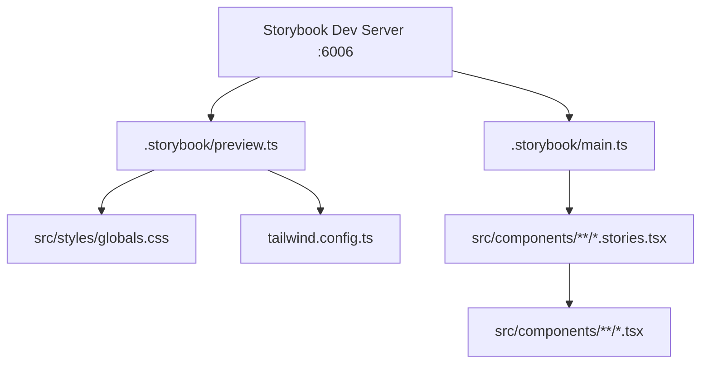

# Design Document: Storybook Setup

## Overview

This design covers integrating Storybook v8 into the `stellar-tipjar-frontend` Next.js/TypeScript/Tailwind project. The goal is a fully configured Storybook environment with stories for every existing UI component, dark mode support via `storybook-dark-mode`, interactive Controls, and auto-generated documentation pages.

Storybook runs as a separate dev server (port 6006) alongside the Next.js app. It shares the project's Tailwind config and CSS variables so stories render with the same visual fidelity as the real app. Components that depend on React context (WalletContext) or external hooks (useWallet) are isolated via story-level decorators and module mocks.

## Architecture



### Key architectural decisions

- **`@storybook/nextjs` framework preset** — handles Next.js Image, Link, font optimisation, and the `@/` path alias automatically. No manual webpack alias config needed.
- **`storybook-dark-mode` addon** — toggles the `dark` class on the preview `<html>` element, activating Tailwind's `dark:` variants. Chosen over `@storybook/addon-themes` because it provides a toolbar toggle out of the box and is widely used with Tailwind.
- **`@storybook/addon-essentials`** — bundles Controls, Actions, Docs, Viewport, Backgrounds, and Toolbars in a single package.
- **Module mocks via `storybook-addon-module-mock`** — used to mock `useWallet` and `createTipIntent` at the module level inside individual stories without affecting other stories.
- **Co-located story files** — each `*.stories.tsx` lives next to its component, keeping stories discoverable and easy to maintain.

## Components and Interfaces

### Storybook Configuration Files

#### `.storybook/main.ts`

```ts
import type { StorybookConfig } from "@storybook/nextjs";

const config: StorybookConfig = {
  stories: ["../src/components/**/*.stories.tsx"],
  addons: [
    "@storybook/addon-essentials",
    "storybook-dark-mode",
    "storybook-addon-module-mock",
  ],
  framework: {
    name: "@storybook/nextjs",
    options: {},
  },
};
export default config;
```

The `@storybook/nextjs` framework preset automatically resolves the `@/` alias from `tsconfig.json` paths, so no additional webpack configuration is required.

#### `.storybook/preview.ts`

```ts
import type { Preview } from "@storybook/react";
import "../src/styles/globals.css";

const preview: Preview = {
  parameters: {
    actions: { argTypesRegex: "^on[A-Z].*" },
    controls: {
      matchers: {
        color: /(background|color)$/i,
        date: /Date$/i,
      },
    },
    darkMode: {
      dark: { appBg: "#151515" },
      light: { appBg: "#f7f2e8" },
      classTarget: "html",
      stylePreview: true,
    },
  },
  decorators: [
    (Story, context) => {
      // Apply CSS variables for the active theme
      const isDark = context.globals.backgrounds?.value === "#151515"
        || context.globals.theme === "dark";
      // Variables are already set by globals.css for light; dark overrides applied here
      return Story();
    },
  ],
};
export default preview;
```

### Story File Interfaces

Each story file follows CSF3 (Component Story Format 3):

```ts
// Minimal story file shape
import type { Meta, StoryObj } from "@storybook/react";
import { ComponentUnderTest } from "./ComponentUnderTest";

const meta: Meta<typeof ComponentUnderTest> = {
  title: "Components/ComponentUnderTest",
  component: ComponentUnderTest,
  tags: ["autodocs"],
};
export default meta;

type Story = StoryObj<typeof meta>;

export const Default: Story = { args: { /* props */ } };
```

### Mock Patterns

**WalletContext mock (Navbar, WalletConnector stories)**

A story-level decorator wraps the story in a `WalletContext.Provider` with a hand-crafted value object, bypassing the real `WalletProvider` which calls Freighter APIs on mount.

```ts
const withMockWallet = (value: Partial<WalletContextType>) =>
  (Story: StoryFn) => (
    <WalletContext.Provider value={{ ...defaultWalletState, ...value }}>
      <Story />
    </WalletContext.Provider>
  );
```

**`useWallet` hook mock (WalletConnector stories)**

`WalletConnector` imports `useWallet` from `@/hooks/useWallet`. Stories use `storybook-addon-module-mock` to replace the module export with a controlled stub, allowing each story to set `isConnected`, `isConnecting`, `error`, etc. independently.

**`createTipIntent` API mock (TipForm stories)**

`TipForm` imports `createTipIntent` from `@/services/api`. Stories mock this module to return a resolved or rejected promise, enabling `SubmitSuccess` and `SubmitError` states without network calls.

## Data Models

### Story Arg Types

Each component's props become Storybook args. The Controls addon infers types from TypeScript interfaces automatically. Manual `argTypes` are only needed for:

- Union types that should render as a `select` control (e.g. `ButtonVariant`)
- `ReactNode` props that should be excluded from Controls (e.g. `icon` on `SectionCard`)
- Callback props auto-wired via `argTypesRegex: "^on[A-Z].*"`

#### Button args

| Arg | Type | Control | Default |
|-----|------|---------|---------|
| `variant` | `"primary" \| "secondary" \| "ghost"` | select | `"primary"` |
| `children` | `ReactNode` | text | `"Button"` |
| `disabled` | `boolean` | boolean | `false` |
| `onClick` | `() => void` | action | — |

#### FormInput args

| Arg | Type | Control | Default |
|-----|------|---------|---------|
| `label` | `string` | text | — |
| `error` | `string \| undefined` | text | `undefined` |
| `registration` | `UseFormRegisterReturn` | — (stub) | stub object |
| `disabled` | `boolean` | boolean | `false` |

#### FormError args

| Arg | Type | Control | Default |
|-----|------|---------|---------|
| `id` | `string` | text | `"error-id"` |
| `message` | `string \| undefined` | text | `undefined` |

#### SectionCard args

| Arg | Type | Control | Default |
|-----|------|---------|---------|
| `title` | `string` | text | — |
| `description` | `string` | text | — |
| `icon` | `ReactNode` | — (excluded) | `<span>🌟</span>` |

#### WalletConnector mock state

| Field | Type | Stories using it |
|-------|------|-----------------|
| `isConnected` | `boolean` | Connected, Disconnected |
| `isConnecting` | `boolean` | Connecting |
| `shortAddress` | `string` | Connected |
| `network` | `string` | Connected |
| `balance` | `string` | Connected |
| `error` | `string \| null` | WithError |

#### TipForm args

| Arg | Type | Control | Default |
|-----|------|---------|---------|
| `username` | `string` | text | `"alice"` |
| `defaultAssetCode` | `string` | text | `"XLM"` |

### File Layout

```
.storybook/
  main.ts
  preview.ts
src/components/
  Button.tsx
  Button.stories.tsx
  Navbar.tsx
  Navbar.stories.tsx
  SectionCard.tsx
  SectionCard.stories.tsx
  WalletConnector.tsx
  WalletConnector.stories.tsx
  ErrorBoundary.tsx
  ErrorBoundary.stories.tsx
  ErrorFallback.tsx
  ErrorFallback.stories.tsx
  forms/
    FormInput.tsx
    FormInput.stories.tsx
    FormError.tsx
    FormError.stories.tsx
    TipForm.tsx
    TipForm.stories.tsx
```


## Correctness Properties

*A property is a characteristic or behavior that should hold true across all valid executions of a system — essentially, a formal statement about what the system should do. Properties serve as the bridge between human-readable specifications and machine-verifiable correctness guarantees.*

### Property 1: Button variant renders correct CSS class

*For any* `variant` value in `"primary" | "secondary" | "ghost"`, rendering `<Button variant={v}>` should produce a button element whose `className` contains the CSS classes defined in `variantStyles[v]`.

**Validates: Requirements 4.3**

---

### Property 2: Button disabled state sets disabled attribute

*For any* `Button` rendered with `disabled={true}`, the underlying `<button>` element should have the `disabled` attribute set, making it non-interactive.

**Validates: Requirements 4.4**

---

### Property 3: SectionCard renders provided title and description

*For any* non-empty `title` string and `description` string, rendering `<SectionCard>` with those props should produce output that contains both strings verbatim.

**Validates: Requirements 6.3**

---

### Property 4: ErrorFallback shows error message when showDetails is true

*For any* `Error` object with a non-empty `message`, rendering `<ErrorFallback error={e} reset={() => {}} showDetails={true}>` should produce output that contains `e.message`.

**Validates: Requirements 8.3**

---

### Property 5: ErrorBoundary catches thrown errors and renders fallback

*For any* `Error` thrown synchronously by a child component during render, `<ErrorBoundary>` should catch it and render `<ErrorFallback>` instead of propagating the error to the React tree.

**Validates: Requirements 8.5**

---

### Property 6: FormInput shows error styling and message for any non-empty error string

*For any* non-empty `error` string, rendering `<FormInput error={e} ...>` should produce an input element with the error border class (`border-error/60`) and a visible error message containing `e`.

**Validates: Requirements 9.4, 9.6**

---

### Property 7: FormError renders message when present, nothing when absent

*For any* non-empty `message` string, `<FormError message={m}>` should render a paragraph containing `m`. *For any* call with `message={undefined}`, `<FormError>` should render nothing (null output).

**Validates: Requirements 10.2, 10.3, 10.4**

---

### Property 8: TipForm shows success state when API resolves

*For any* resolved `createTipIntent` response, submitting the TipForm should result in the success message element being present in the rendered output and the error message element being absent.

**Validates: Requirements 11.4**

---

### Property 9: TipForm shows error state when API rejects

*For any* rejected `createTipIntent` error, submitting the TipForm should result in the error message element being present in the rendered output and the success message element being absent.

**Validates: Requirements 11.5**

---

## Error Handling

### Story-level isolation failures

- If a component throws during story render (e.g. missing context), Storybook shows a red error overlay in the preview iframe. Each story that depends on context (WalletContext, react-hook-form) must provide the required context via a decorator or stub.
- `WalletConnector` stories must mock `useWallet` before the component mounts, otherwise the hook will attempt to call Freighter APIs and throw.
- `TipForm` stories must mock `createTipIntent` before the form is submitted, otherwise real network requests will be made.

### Build-time errors

- TypeScript errors in story files will fail `npm run build-storybook`. All story files must pass `tsc --noEmit`.
- Missing `@/` alias resolution will produce a module-not-found error at build time. The `@storybook/nextjs` preset handles this automatically via `tsconfig.json` paths.

### Dark mode CSS variable gaps

- If a component uses a CSS variable (e.g. `var(--surface)`) that is not overridden in the dark theme decorator, it will render with the light-mode value in dark mode. The global decorator must set all four variables (`--surface`, `--background`, `--foreground`, `--accent`) for the dark theme.

### FormInput registration stub

- `FormInput` requires a `UseFormRegisterReturn` object. Stories must provide a stub with at minimum `{ name, ref, onChange, onBlur }` to avoid runtime errors from destructuring.

## Testing Strategy

### Dual testing approach

Both unit tests and property-based tests are used. Unit tests cover specific examples and integration points; property tests verify universal correctness across generated inputs.

### Unit tests (Vitest + React Testing Library)

Unit tests focus on:
- Verifying story meta exports have the correct `title`, `component`, and `tags` values (examples for requirements 1.5, 4.1, 5.1, 6.1, 7.1, 8.1, 8.4, 9.1, 10.1, 11.1, 12.1)
- Verifying `.storybook/main.ts` contains the correct framework, addons, and stories glob (examples for requirements 1.1, 1.2, 1.5, 2.1, 3.1)
- Verifying `.storybook/preview.ts` contains the correct imports and parameters (examples for requirements 1.6, 2.3, 3.2)
- Verifying named story exports exist (examples for requirements 4.2, 4.5, 5.3, 5.4, 6.2, 6.4, 7.3–7.6, 8.2, 8.3, 9.3, 9.5, 11.3)
- Rendering stories with mocked context and asserting no crash (examples for requirements 5.2, 7.2, 9.2, 11.2)

### Property-based tests (fast-check + Vitest)

Each property test runs a minimum of 100 iterations. Tests are tagged with a comment referencing the design property.

**Tag format:** `// Feature: storybook-setup, Property {N}: {property_text}`

| Property | Test description | Generator |
|----------|-----------------|-----------|
| P1 | Button variant class | `fc.constantFrom("primary", "secondary", "ghost")` |
| P2 | Button disabled attribute | `fc.boolean()` (filter to `true`) |
| P3 | SectionCard renders title/description | `fc.string({ minLength: 1 })` × 2 |
| P4 | ErrorFallback shows message when showDetails=true | `fc.string({ minLength: 1 })` for error message |
| P5 | ErrorBoundary catches thrown errors | `fc.string({ minLength: 1 })` for error message |
| P6 | FormInput error styling for non-empty error | `fc.string({ minLength: 1 })` for error |
| P7 | FormError renders/hides based on message presence | `fc.option(fc.string({ minLength: 1 }))` |
| P8 | TipForm success state on API resolve | `fc.record({ intentId: fc.string(), checkoutUrl: fc.option(fc.string()) })` |
| P9 | TipForm error state on API reject | `fc.string({ minLength: 1 })` for error message |

### Configuration

```ts
// vitest.config.ts addition
import { defineConfig } from "vitest/config";
import react from "@vitejs/plugin-react";
import path from "path";

export default defineConfig({
  plugins: [react()],
  resolve: {
    alias: { "@": path.resolve(__dirname, "src") },
  },
  test: {
    environment: "jsdom",
    setupFiles: ["./src/test/setup.ts"],
  },
});
```

Property tests use `@fast-check/vitest` for seamless integration:

```ts
import { test, fc } from "@fast-check/vitest";

// Feature: storybook-setup, Property 1: Button variant renders correct CSS class
test.prop([fc.constantFrom("primary", "secondary", "ghost")])(
  "Button renders correct class for any variant",
  (variant) => {
    const { container } = render(<Button variant={variant}>Click</Button>);
    const btn = container.querySelector("button")!;
    expect(btn.className).toContain(variantStyles[variant].split(" ")[0]);
  },
  { numRuns: 100 }
);
```
