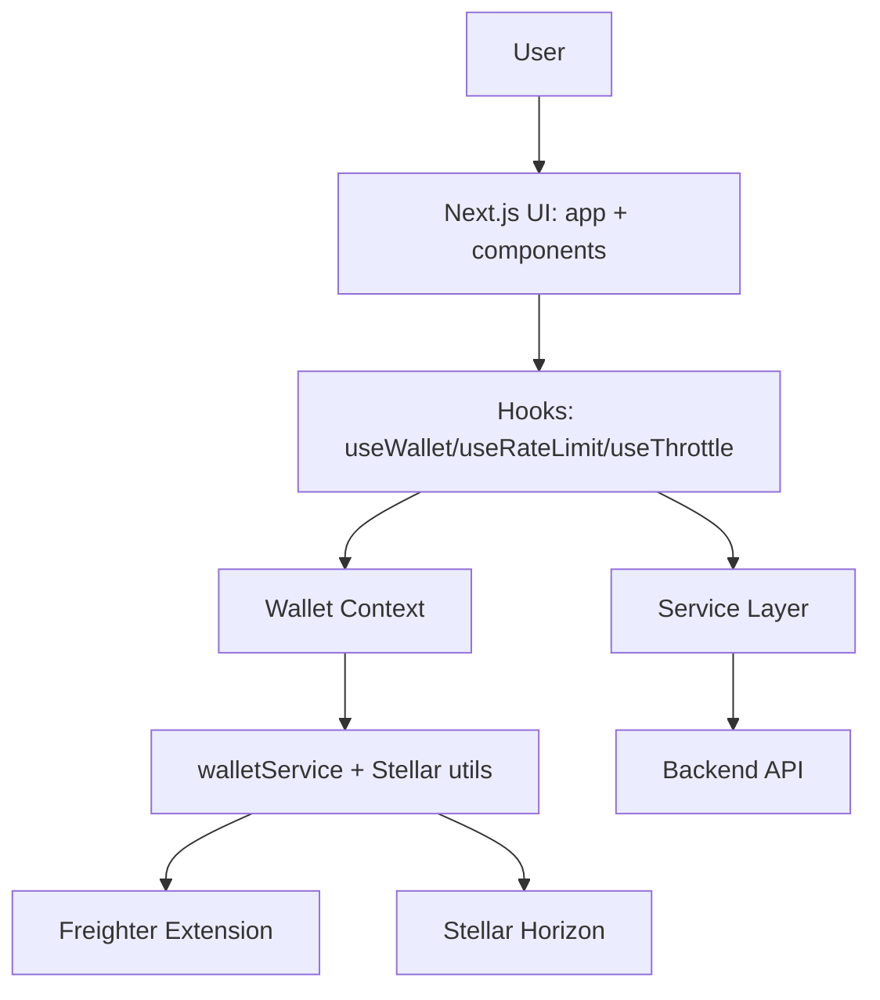

# Architecture Overview

## Purpose

`stellar-tipjar-frontend` is a Next.js App Router application for browsing creators, connecting a Freighter wallet, and supporting a tip flow backed by API endpoints and Stellar transactions.

## Tech Stack

- Next.js (App Router)
- React + TypeScript
- Tailwind CSS
- Stellar SDK (`@stellar/stellar-sdk`)
- Freighter API (`@stellar/freighter-api`)

## High-Level Architecture



## Project Structure

```text
src/
  app/          Route segments and page entry points
  components/   Reusable presentational and interactive UI
  contexts/     Global React context providers (wallet)
  hooks/        Reusable stateful client logic
  services/     API and wallet integration layer
  styles/       Global CSS and visual primitives
  utils/        Stateless helpers and utility classes
```

## Rendering Model

- Server Components:
  - Route pages like `src/app/creator/[username]/page.tsx` fetch initial data.
- Client Components:
  - Wallet and interaction components (`WalletConnector`, wallet context/hook).
- Shared layout:
  - `src/app/layout.tsx` wraps all pages with `WalletProvider` and `Navbar`.

## Data Flow

1. User triggers UI interaction.
2. Component invokes hook or service function.
3. Service layer (`src/services/api.ts` or `src/services/walletService.ts`) performs network call.
4. Result updates component/local/context state.
5. React re-renders affected UI.

## API Request Control Flow

`src/services/api.ts` centralizes:

- path-level throttling (`DEFAULT_THROTTLE_MS`)
- global client-side rate limiting (`10 requests / 60s`)
- queueing non-critical requests
- exponential backoff retries for queued requests
- status subscription for UI feedback (`subscribeToApiRateLimit`)

```mermaid
flowchart LR
  Req[request()] --> Check{Rate limiter allows?}
  Check -- yes --> Throttle[Apply path throttle] --> Fetch[fetch()]
  Check -- no + critical --> Err[ApiRateLimitError]
  Check -- no + non-critical --> Queue[RequestQueue.enqueue]
  Queue --> Retry[Exponential backoff + wait retryAfter]
  Retry --> Fetch
```

## Wallet Flow

1. `WalletProvider` bootstraps connection and watches wallet changes.
2. `walletService.connect()` validates Freighter, permission, and address retrieval.
3. Balance is fetched via Horizon (`getBalance` in `src/utils/stellar.ts`).
4. `useWallet()` exposes context plus derived `shortAddress`.

## Architecture Decisions

- **Service layer boundary** keeps IO and error handling out of UI components.
- **Context for wallet state** avoids prop drilling and provides app-wide wallet access.
- **Typed responses/interfaces** improve confidence in API integration.
- **Utility classes for rate limiting** isolate policy logic from route components.

## Scalability Notes

- Add more service modules as backend surface expands (tips, creators, transactions).
- Introduce dedicated state library only when context/local state becomes insufficient.
- Add test tooling before expanding business-critical flows.
