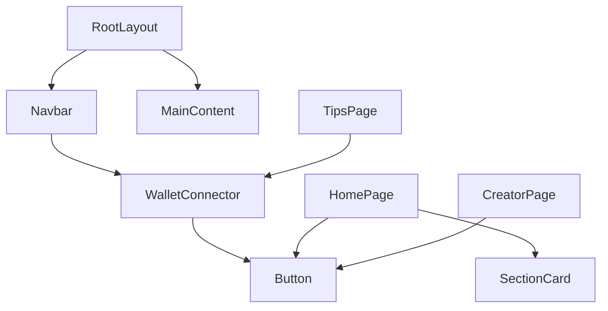

# Component Documentation

## Overview

Reusable components live in `src/components`. They should remain focused on UI composition and delegate data/business logic to hooks or services.

## `Button`

Path: `src/components/Button.tsx`

### Usage

```tsx
import { Button } from "@/components/Button";

<Button onClick={handleClick}>Primary action</Button>;
<Button variant="secondary">Secondary action</Button>;
<Button variant="ghost">Tertiary action</Button>;
```

### Props

- `variant`: `"primary" | "secondary" | "ghost"` (default: `"primary"`)
- All standard `button` props (`disabled`, `onClick`, `type`, `className`, etc.)

### Behavior and Accessibility

- Uses semantic `<button>`
- Supports keyboard activation and focus styles (`focus-visible:ring-*`)
- Default `type="button"` to avoid accidental form submission

## `Navbar`

Path: `src/components/Navbar.tsx`

### Responsibilities

- Primary site navigation (`Home`, `Explore Creators`, `Send Tips`)
- Renders `WalletConnector` for connection state/actions

### Notes

- Uses sticky header with subtle backdrop blur
- Navigation links are intentionally small/static and easy to extend

## `WalletConnector`

Path: `src/components/WalletConnector.tsx`

### Responsibilities

- Shows connection CTA when disconnected
- Shows connected wallet metadata when connected:
  - network
  - XLM balance
  - short address
- Displays wallet errors
- Exposes disconnect action

### Hook Dependency

Consumes `useWallet()` from `src/hooks/useWallet.ts`.

### States

- `isConnecting`: disables button and shows `Connecting...`
- `isConnected`: switches to connected summary UI
- `error`: renders inline error banner

## `SectionCard`

Path: `src/components/SectionCard.tsx`

### Usage

```tsx
<SectionCard
  title="Creator Profiles"
  description="Dynamic profile pages"
  icon={<span>1</span>}
/>
```

### Props

- `title: string`
- `description: string`
- `icon: ReactNode`

## Component Hierarchy (Current)



## Guidelines for New Components

- Keep presentational components stateless when possible.
- Put network access in `src/services`, not components.
- Extract reusable stateful logic into hooks under `src/hooks`.
- Prefer typed props and narrow unions for variants/sizes.
