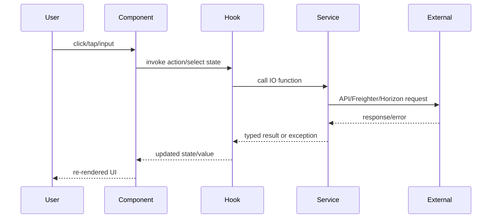

# State Management and Data Flow

## Current State Strategy

The project currently uses built-in React primitives:

- local component state (`useState`)
- shared context (`WalletContext`)
- derived values in custom hooks (`useWallet`, `useRateLimit`)

No external state manager is currently used.

## Global State: Wallet

Path: `src/contexts/WalletContext.tsx`

### Stored State

- `publicKey`
- `balance`
- `isConnecting`
- `error`

### Exposed Actions

- `connect()`
- `disconnect()`
- `refreshBalance()`

### Lifecycle Behavior

- On mount, checks whether wallet permission already exists.
- Starts a Freighter wallet-change watcher.
- Refreshes balance when `publicKey` changes.

## Derived State via Hooks

### `useWallet`

Path: `src/hooks/useWallet.ts`

- Wraps wallet context
- Adds computed `shortAddress`

### `useRateLimit`

Path: `src/hooks/useRateLimit.ts`

- Subscribes to rate-limit status from API service
- Keeps countdown in sync with 1-second polling while limited

### `useThrottle`

Path: `src/hooks/useThrottle.ts`

- Returns a throttled callback
- Prevents high-frequency UI-triggered action spam

## Data Flow Pattern

## Error State Handling

- Wallet errors are stored in context and rendered by `WalletConnector`.
- API errors are thrown from service layer and handled by calling components/pages.
- Rate-limit state is available via `ApiRateLimitStatus` for user messaging.

## Scaling Guidance

- Keep context small and domain-focused.
- Add additional contexts per bounded area (e.g., tip form) before introducing global stores.
- Consider a dedicated server-state solution only when cache invalidation and background sync complexity increases.
